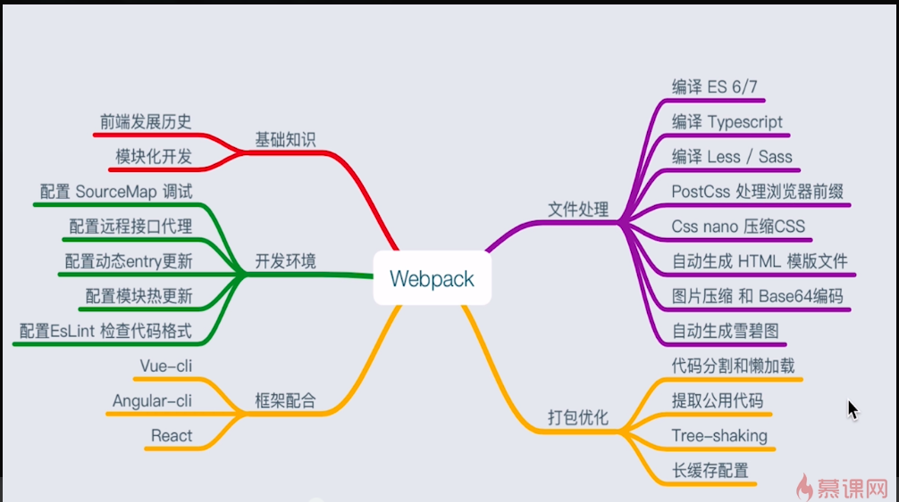

# 思路

## 什么是 Webpack ?

At its core, **webpack** is a *static module bundler* for modern JavaScript applications. When webpack processes your application, it internally builds a *dependency graph* which maps every module your project needs and generates one or more *bundles*.

## static module bundler

## dependency graph

## Core Concepts

- Entry
- Output
- Loaders
- Plugins

## Webpack v4 和 v3 的区别？

- Since version 4.0.0, **webpack does not require a configuration file** to bundle your project, nevertheless it is [incredibly configurable](https://webpack.js.org/configuration) to better fit your needs.

## 慕课网切入点

- 前端工作流？前端工程化
- 前端发展历史到为什么前端工程化、自动化
- 模块化开发
- 为什么 webpack 独领风骚