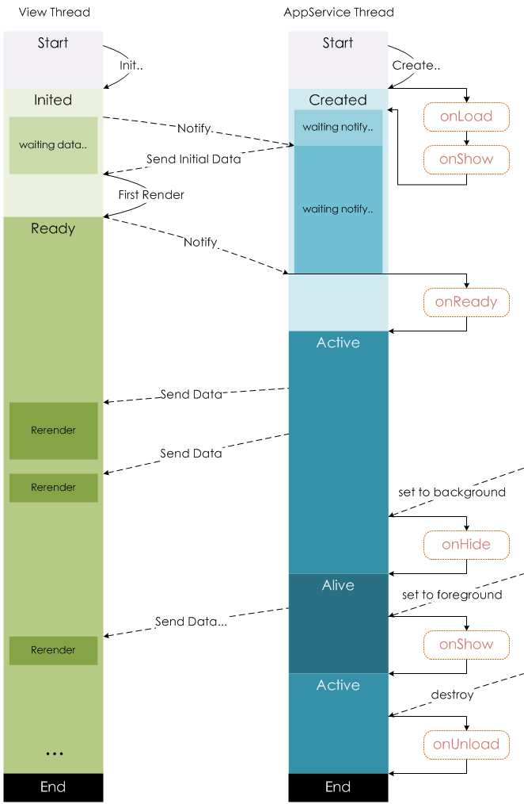

# 小程序

## 生命周期

## WXML

WXML 中事件绑定，`bind`事件绑定不会阻止冒泡事件向上冒泡，`catch`事件绑定可以阻止冒泡事件向上冒泡。

WXML 提供两种文件引用方式`import`和`include`。
`import`可以在该文件中使用目标文件定义的`template`。
`include`可以将目标文件除了`<template/> <wxs/>`外的整个代码引入，相当于是拷贝到`include`位置。