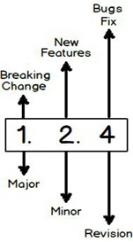

# 18-07-31

## 什么是 package-lock.json

package-lock.json 是项目中 node\_modules 文件夹实际安装包的结构，因为 package.json 大多包的版本号支持 semantic versioning。在第一次安装包时，会生成 package-lock.json，以后安装时团队所有成员安装包的版本都以 package-lock.json 为准。

